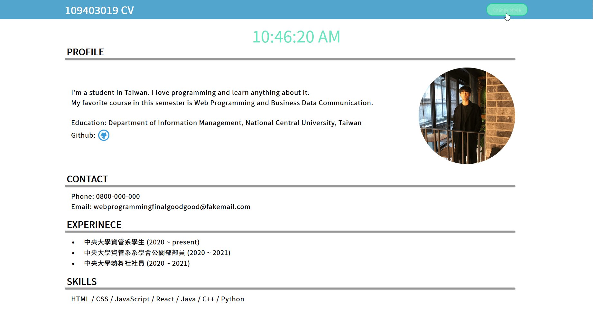

# NCU Web Programming Final 上機考 - CV

2022/6/6 NCU 資管二A109403019 鄒翔宇

View on Github Page: [click me](https://xxrjun.github.io/)

Using **Sass** to write .scss to generate .css file.

In `index.html`, using **"CSS:"** as a header in comment to mark my css styling.

<!-- PROJECT Demo -->

  <h3 align="left">Demo</h3>
  

(<a href="#top">back to top</a>)

### TODO

**評分標準**

- [x]  建立 special repo 和 README.md，完成 Github 個人主頁 profile 設定
- [x]  建立 repo 並完成 CV 首頁， 新增README.md
- [x]  透過 Github Pages 發布 CV 首頁在 github.io
- [x]  <body> 內有 10 種以上 html tag
- [x]  成功使用 2 種 JS 語法
- [x]  將 CSS 放置於 .css，並使用 link 整合，.css 內需具備 5 種以上 css styling，並於 index.html 註解標示說明搭配之 CSS 特效效果
- [x]  Others: Commit、網頁內容及排美觀層度

**Extra**

- [x]  Date Time with Effect
- [x]  Light/Dark mode with Effect

(<a href="#top">back to top</a>)

### REFERENCES & SOURCES
- [NCU Logo](https://www.ncu.edu.tw/en/pages/show.php?top=1&num=19)
- [Github Logo](https://www.pngegg.com/en/png-bktwj/download)
- [Button Styling](https://webdeasy.de/en/top-css-buttons-en/)

(<a href="#top">back to top</a>)

